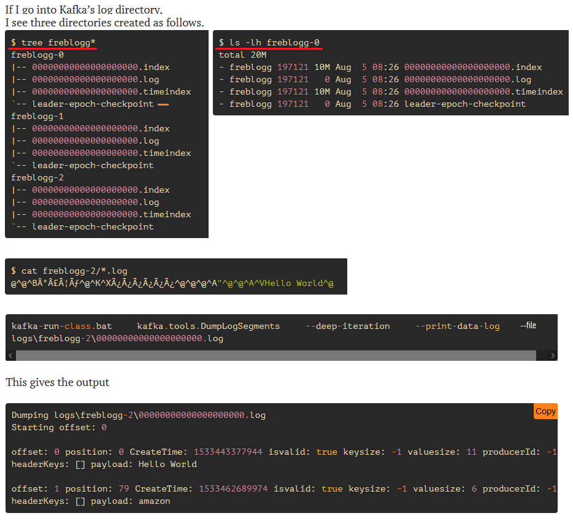
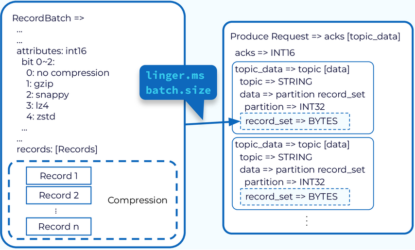
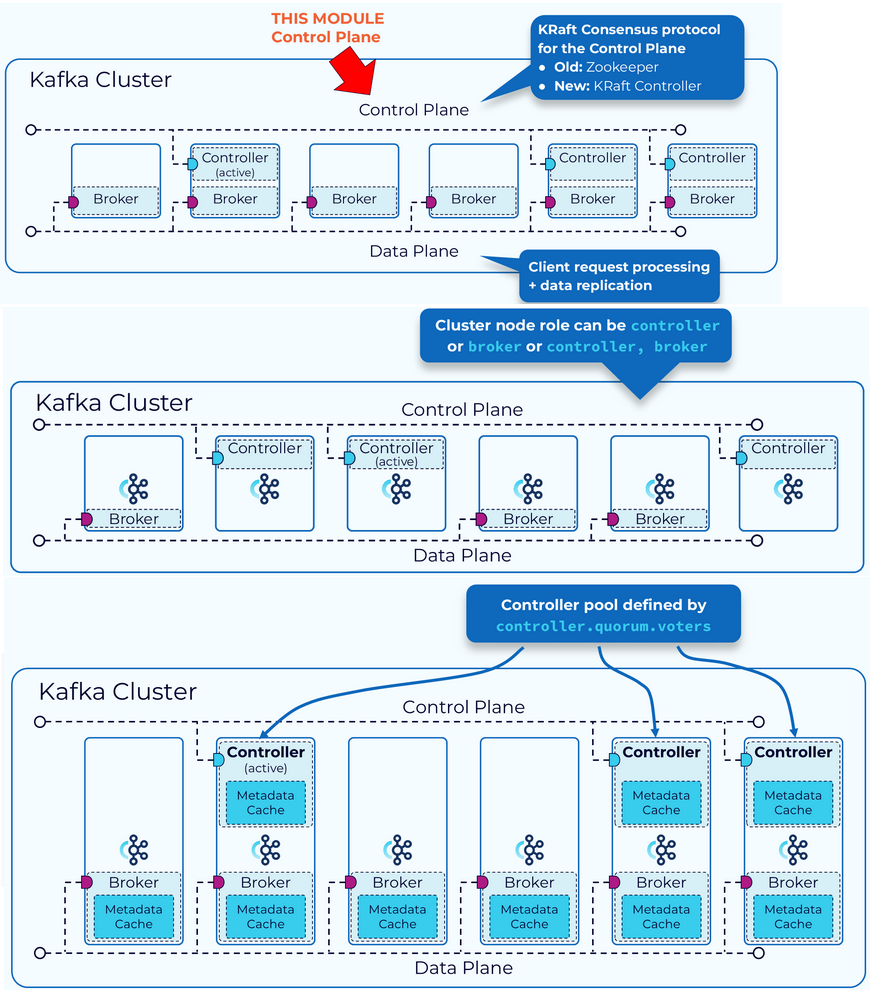
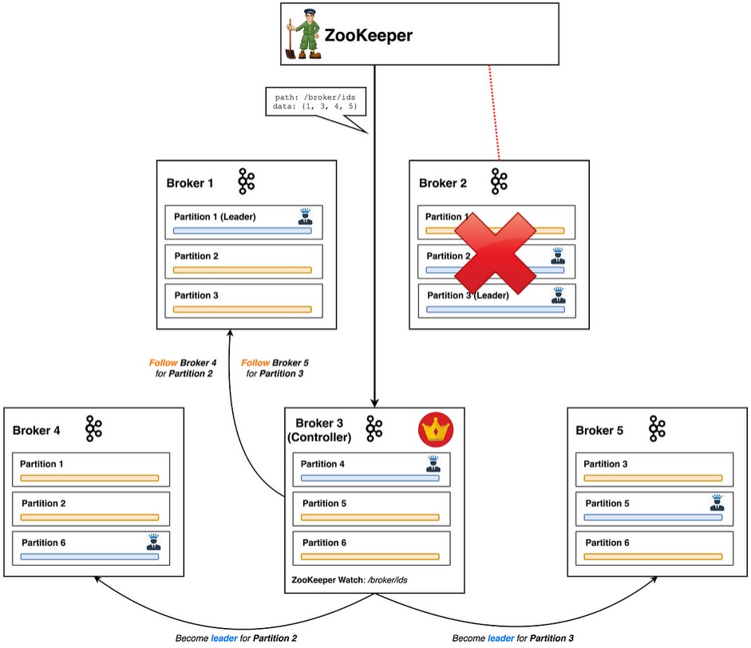
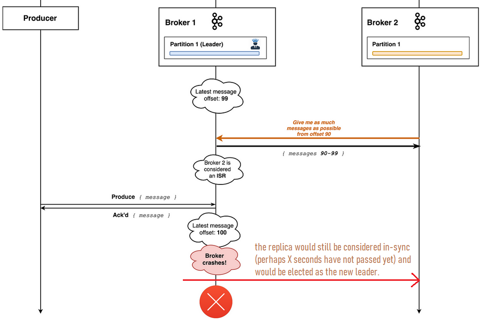
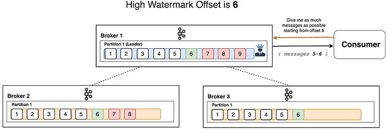
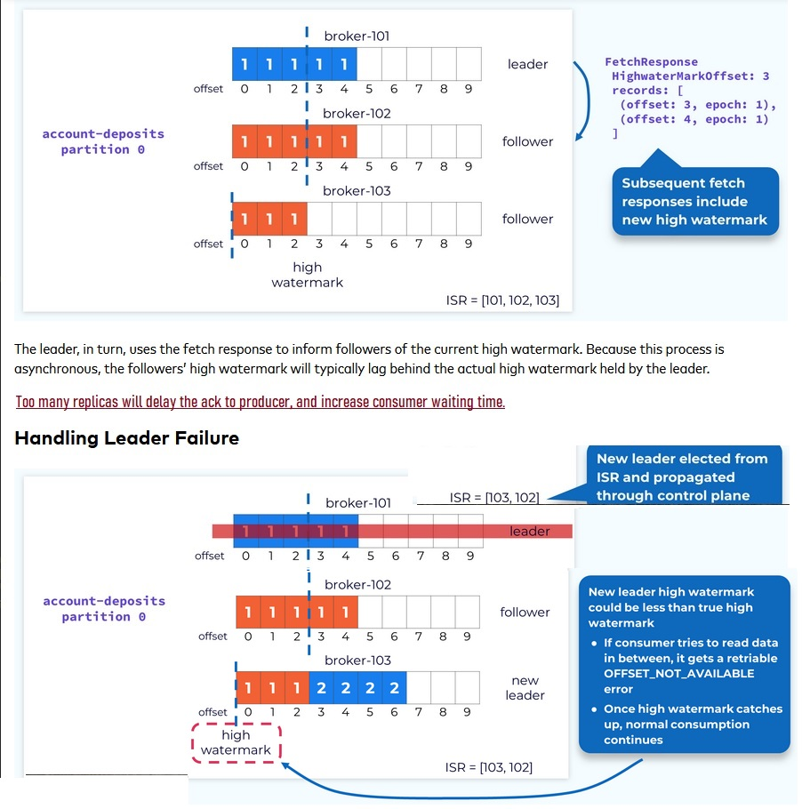
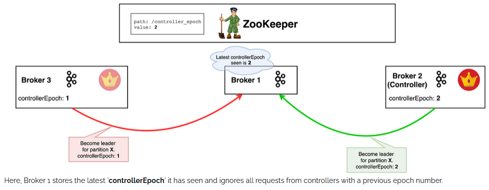

## Zookeeper Responsibilities
Distributed coordination + High Availability
1. Alive Kafka brokers
2. Topic Configuration
3. In Sync Replicas
4. Topic Assignment


Concept of quorum = minimum nodes running in cluster

| Number of Nodes | Number for Quorum |
|-----------------|-------------------|
| 3 nodes         |   at least 2 nodes|
| 5 nodes         |   at least 3 nodes|
| 7 nodes         |   at least 4 nodes|
| odd number is recommended and more fault tolerant |

For an ensemble (cluster of nodes) to be healthy, it requires the majority (50%) of the servers to be online and communicating with each other, were the majority is referred to a as a Quorum.

### Zookeeper properties (config zookeeper.properties)

**Data directory** - /tmp/.../zookeeper - Folder where zookeeper stores its data like IDs
**tickTime** - monitoring every X ms
**initLimit** - amount of tie in ticks a Zk follower takes to connect to leader
**syncLimit** - amount of tie in ticks allowed for follower to sync with leader
**server.1=localhost:2666:3666** localhost = where node is deployed. first port = port for Zk communication in cluster (node to node). second port = port for leader election.
**clientPort** - for kafka comm between client


## Kafka Cluster
A cluster is a group of multiple brokers. A broker = server = node. Brokers receive and send data.   
A broker is identified with an integer ID.    
Each broker will contain certain topic partitions.    
Brokers are self identifiable to the clusters, it is only necessary to connect to one broker.   
Same topic can be distributed/scaled across different brokers/servers.   


A single Kafka server is called a broker. Messages are received from producers, assigned offset and stored to disk. Brokers are designed to operate as part of a **cluster**, where one broker functions as the controller by election. This controller is responsible for admin ops: assigning partitions to brokers and monitoring for broker failures. 

For network efficiency, messages are written to Kafka in batches, i.e. a collection of messages all of which are being produced to the same topic and partition. Observe the tradeoff between latency and throughput: the larger the batch, the more messages can be handled per unit time, but the longer it takes an individual message to propagate. Compressing messages mitigates data transfer efficiency and storage. 

By using well-defined schemas, and storing them in a common repository, the messages in Kafka can be understood between pub and sub without coordination. Messages are appended as read only in order of entry = append only log. Topics have multiple partitions and message order is not guaranteed in entire topic. Each partition can be hosted on a different server =  a topic can be scaled horizontally across multiple servers. Additionally partitions can be replicated across different servers. 


The producer generates a message to a specific topic. By default, the producer will balance messages over all partitions of a topic evenly. A producer can direct messages to a specific partition using message key. Consumers subscribe to one or more topics and reads messages in the order produced to each partition. Consumers keep track of consumed messages by offset. Consumers can stop and restart as Kafka keeps track of the incrementing offsets. Consumers can reset offset and start reading from beginning. 


A partition is owned by one leader in a broker. Replication is assigned to additional brokers called **followers** of the partition. Message retention is either by period or storage limit, messages expire and get deleted thereafter. Or also by key, keeping only the latest one. 

# Topics
- *Topics* are a particular *stream* of data. Topics are identified by their *names*. The *sequence* of messages are called streams. Topics cannot be *queried*.    
- Topics are *immutable*. Once data is written to a partition, it cannot be changed.    
- Data is only *kept* for a default of one week, and is also configurable.    
- Topics are essentially an append-only log.    
- When a new topic is created we can specify explicitly or through defaults, how many replicas we want. Then each partition of that topic will be replicated that many times.
- This number is referred to as the **replication factor**.

# Partitions and Offsets
- Topics can be split in *partitions*.     
- *Messages* in each partition are given an incremental *offset* value.   
- Offsets only have a *meaning* in the partition and so order is only guaranteed in that partition. The same sequence is used across all partitions.    
- Offsets are not reused once message is *removed*. Similar to table PK.    
- Data is randomly assigned to the topic's paritions, unless a key is provided.   




# Producers
Producers know in advance to which partition to write to. It is not something that Kafka decides.
In case of failure, Kafka and Producers help with recovery.

- Producers may choose to send a key with the message (string, num, binary, etc)
- All messages with that key will be routed to the same partition.
- A key is typically sent to preserve order. Ex. messages by individual truck.
- Round Robin -> Data is distributed across all partitions in a topic.
- Key Based Ordering -> When we specify a key, then the same key is going to end up in the same partition


## Message


## Message Serializer
Kafka only accepts bytes as an input from producers and sends bytes out to consumers. This means some code needs to prepare data in bytes for Kafka.
Message serialization means transforming data/objects into bytes.


## Kafka message Key Hashing
A Kafka partitioner is a code logic that takes a record and determines to which partition to send it into.


## Consumers
Consumers request data from Kafka. They read/pull data from a topic (identified by name).
Consumers automatically know which broker to read from.
In case of failures, consumers know how to recover.
Data is read in order from low to high offset, **within each partition**. Even when a couple of partitions are read by the same consumer, order is only for the partiton.


## Consumer Deserializer
Consumers transform serial byte data into objects
Consumers must know in advance the format of the message. Ex. if Key is Int, then use an Int Deserializer.
Topic format must never change, other wise stream shall corrupt. 


## Consumer Groups
**Consumer group** is one or more consumers that work together to consume a topic. The group ensures that each partition is only consumed by one member. The mapping of a consumer to a partition is often called **ownership**. If a single consumer fails, partitions a reassigned. Whenever consumers join and leave groups, partitions are going to be reassigned. This is called rebalance.

Rebalance/reassignment also happens when new partitions are added to a topic

Consumer groups are a bunch of consumers grouped together for a purpose:
- The same partition cannot be read by different consumers in the same group / two consumers in the same group cannot read the same partition.
- Internally, Kafka keeps track of __consumer_offset per group.
- One consumer in one group can read from one or multiple partitions.
- Ex. one consumer group for the raw storage. Another group for real time risk detection.


To define a consumer group, set the **group.id** in the consumer config so every new instance of that consumer will be added to the group. Then when the cons grp subscribes to one or more topics, their partitions will be evenly distributed between the consumers. This allows for parallel processing of the data in these topics. 
## Delivery Semantics of Consumers
- By default, Java consumers will automatically commit offsets (at least once)
- At least once:
- - Offsets are commited after the message is processed
- - If the processing goes wrong, the message will be read again
- At most once:
- - Offsets are commited as messages are received
- Exactly once:
- - For Kafka -> Kafka workflows (from topic to topic): use Transactional API (Kafka Streams API)

## Topic Replication Factor
Replication should be set to at least 2 or 3. In case of failure, systems can keep functioning.
At any one time, only ONE broker can be a leader for a given partition.
Producers can only send data to the broker that is leader of that partition.
If data is replicated fast enough, this is called *In Sync Replica*.
Kafka now allows consumers to read from a replica, perhaps its closer to the consumer.


# Partitions
In Kafka, the latency of the producer is often defined as the time it takes for a message produced by the client to be ack by Kafka. When a producer is ready to send an event record, it will use a **configurable partitioner** to determine the topic partition to assign to the records. If the record has a key, then the default partitioner will use a hash of the key to determine the mapping of a key to a partition. This means that adding partitions to a topic will completely alter the formula.
```Python
targetPartition = Math.abs(Utils.murmur2(keyBytes)) % (numPartitions - 1)
```
Otherwise, a partition strategy is used by the **producer** to balance the data in the partitions.

If we send several records to the same partition at around the same time, they can be sent as a batch. Processing each batch requires a bit of overhead, with each of the records inside the batch contributing to that cost. **Records in smaller batches have a higher effective cost per record. Smaller batches lead to more requests and queuing, resulting in higher latency.** Sending records one at a time would be inefficient due to the overhead of repeated network requests. So, the producer will accumulate the records assigned to a given partition into batches, which also provides for much more effective compression.



A batch is completed either when it reaches a certain size **(batch.size default 16,384bytes)** or after a period of time **(linger.ms default 0)**, and both are configured in the producer. Once batch size is reached or linger has passed, the batch is sent as soon as it is able. 

Even when **linger.ms = 0**,  the producer will group records into batches when they are produced to the same partition around the same time. This is because the system needs a bit of time to handle each request, and batches form when the system cannot attend to them all right away.

Part of what determines how batches form is the partitioning strategy; if records are not sent to the same partition, they cannot form a batch together. Kafka allows users to select a partitioning strategy by configuring a **Partitioner** class.

## Partition Acknowledgements
Producers can choose to receive ack for data writes:    
- acks0 = Producers won't wait for acks (potential data loss)
- acks1 = Producers will wait for leader acks (few data loss)
- acksAll = Producers will wait for leader and replica acks (no data loss)

### Sticky Partitioner


Once the batch at that partition is filled or otherwise completed, the sticky partitioner randomly chooses and "sticks" to a new partition. This way, records are about evenly distributed among all the partitions while getting the added benefit of larger batch size. 

> Benchmark Test: https://www.confluent.io/blog/apache-kafka-producer-improvements-sticky-partitioner/
> Benchmark Test: https://developer.confluent.io/learn-kafka/architecture/producer-hands-on/

### Sending with Key


### Partition Rebalance
Whenever consumers join and leave groups, partitions are going to be reassigned. This is called rebalance. Rebalance/reassignment also happenes when new partitions are added to a topic

- **Kafka Consumer**: partition.assignment.strategy
  - *(Eager Rebalance Type) RangeAssignor*: assign partitions on a per-topic bases (can lead to imbalance)
  - *(Eager Type) RoundRobin*: assign partitions across all topics in round-robin fashion, optimal balance
  - *(Eager Type) StickyAssignor*: balanced like RoundRobin, and then minimizes partition movements when consumer join/leaves group in order to minimize movements
  - *(Cooperative Rebalance Type) CooperativeStickyAssignor*: rebalance strategy is identical to Sticky Assignor but supports cooperative rebalances and therefore consumer can keep consuming from topic
  - *The default assignor is [RangeAssignor, CooperativeStickyAssignor]*: which will use the RangeAssignor by default, but allows upgrading to CooperativeStickyAssignor with just a single roling bounce that removes the range assignor from the list. 

  - **Kafka Connect**: Cooperative rebalance
  - **Kafka Streams**: StreamsPartitionAssignor

  


#### Static Group Membership
- By default, when a consumer leaves a group, its partitions are revoked and reassigned
- If it re-joins, it will have a new *member ID* and new partitions will be reassigned
- If one specifies the *group.instance.id* it makes the consumer a **static member**
- Upon leaving, the consumer has up to *session.timeout.ms* to join back and get back its partitions (else they will be re-assinged), without triggering a rebalance
- This is helpful when consumers maintain local state and cache


## Streams
A stream is a an immutable, append-only collection that represents a series of historical facts, or events. Once a row is inserted into a stream, the row can never change. You can append new rows at the end of the stream, but you can’t update or delete existing rows.
Kafka can aggregate a stream with KsqlDB and a consumer can subscribe to the results. 

## Tables
A table is a mutable collection that models change over time. It uses row keys to display the most recent data for each key. All but the newest rows for each key are deleted periodically. Also, each row has a timestamp, so you can define a windowed table which enables controlling how to group records that have the same key for stateful operations – like aggregations and joins – into time spans. Windows are tracked by record key.

# Controller Broker

A distributed system must be coordinated by a Controller. All cluster metadata will be stored in Kafka topics and managed internally. The role of a Kafka instance can be that of a controller, broker, or both.  If we have a cluster of N brokers, only one can be active (elected) at any point in time.



It is a normal broker that simply has additional responsibility. That means it still leads partitions, has writes/reads going through it and replicates data.
The most important part of that additional responsibility is keeping track of nodes in the cluster and appropriately handling nodes that leave, join or fail. This includes rebalancing partitions and assigning new partition leaders.
There is always exactly one controller broker in a Kafka cluster.
Duties: to name a few — create/delete a topic, add partitions (and assign them leaders) and deal with situations in which brokers leave the cluster.    

The brokers that serve as controllers, in a KRaft mode cluster, are listed in **controller.quorum.voters**, set on each broker. This allows all of the brokers to communicate with the controllers. 

The controller gets notified of a missing partition leader by Zk, and acts upon it. It decides which nodes should become the new leaders for the affected partitions. It then informs every associated broker that it should either become a leader or start replicating from the new leader via a 'LeaderAndIsr' request.



Correct partition leader placement is critical for load balancing of the cluster. In the event of failure, some broker take over and becomes leaders for more partition and this places additional load on the broker.

Kafka Controller decides which broker to lead, but the user can configure **Rack-Aware-Leader**. By **auto.leader.rebalance.enabled=true**, kafka checks if the preferred leader is alive and elect it back. 

## In-Sync Replica
Producers will write to the leader replica. Is a broker which has fully caught up to a partition it is following. Partition leaders are responsible for keeping track of which broker is an ISR and which isn't. Kafka's availability and durability guarantees rely on replication.    
For a follower broker to be promoted to a leader, it must be an ISR. Every partition synchronization is updated by the partition leader and controller. The process is called **clean leader election**.

The criteria for considering a partition follower in-sync with its leader is the following:

1. It has fetched messages from the partition leader in the last X seconds. (configurable through 'replica.lag.time.max.ms'). It is not enough to fetch any messages — the fetch request must have requested all messages up to the leader log’s end offset. This ensures that it is as in-sync as possible.
2. It has sent a heartbeat to Zookeeper in the last X seconds. (configurable through 'zookeeper.session.timeout.ms')



## High Watermark Offset
Once all of the followers in the ISR have fetched up to a particular offset, the records up to that offset are considered committed and are available for consumers. Leader brokers never return messages which have not been replicated to all ISRs. Brokers keep track of the so-called high watermark offset — the largest offset which all in-sync replicas have. By returning messages no greater than the high watermark to the consumer, Kafka ensures that consistency is maintained and that non-repeatable reads cannot happen.

Followers that lag more than **replica.lag.time.max.ms** behind the leader are removed from the ISR.




## Split Brain

Imagine a controller broker dies. There is the problem that you cannot truly know whether a broker has stopped for good or has experienced an intermittent failure. A controller node which had been deemed dead by the cluster and has come back online is defined as **zombie controller**. Another broker has taken its place but the zombie controller might not know that yet. This can easily happen: network glitch or long Garbage collect pause. The original controller does not realize and it will continue acting as if it is the current controller. This is a common scenario in distributed systems and is called **split-brain**.    

Fix: An **epoch number** is simply a monotonically increasing number — if the old leader had an epoch number of 1, the new one will have 2. Brokers can now easily differentiate the real controller by simply trusting the controller with the highest number. The controller with the highest number is surely the latest one, since the epoch number is always-increasing. This epoch 



# Kafka Configs
**Listeners**: One needs to tell Kafka how the brokers can reach each other, but also make sure external clients can reach the brokers. Brokers can have **multiple** listeners. A listener is a CSV Key Value combination of: Host/IP, Port, Protocol, which the broker binds to for listening.    
**Advertised Listeners**: A listener is a CSV Key Value combination of: Host/IP, Port, Protocol, used by clients to connect to Kafka. This is the metadata passed back to the clients. When a client (prod/cons) starts, it will request metadata about which broker is the leader for a partition and can do this from any broker.     
**Security protocol**: Key Value for the security protocol to use per listener name.    
**Inter boker listener**: brokers communicate between themselves usually on internal network. The IP must be accessible between brokers.    